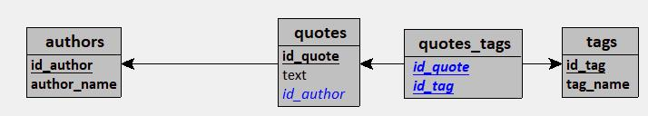
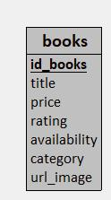

# Livrable 1.1 : Dossier d'Architecture Technique (DAT)

**1. Choix d'architecture globale**
- Quelle architecture proposez-vous ? (Data Lake, Data Warehouse, Lakehouse, base NoSQL, autre ?)

Pour le sctockage des données bruts, des images, des exports et des backups j'utiliserai `MinIO`.
Pour le stockage des données structurées j'utiliserai `PostgreSQL`.

- Pourquoi ce choix plutôt qu'une alternative ?

`MinIO` est basé sur un stockage objet qui permet de stocker tout type de fichier. Il propose également l'ajout de métadata pour enrichir les données.
`PostgreSQL` est un SGBDR idéal pour les données structurées.

- Quels sont les avantages et inconvénients de votre choix ?

Technologie | Avantage | Incovénient
:- | :- | :-
`MinIO` | Stockage object, métadata, stockage massif, stockage au format original, séparation des couches logistiques (bronze, silver, gold), scalabilité horizontale | Stockage uniquement, pas d'analyse de données
`PostgreSQL` | Système de requête complet permettant une analyse fine des données | Données structurées uniquement, scalabilité verticale

**2. Choix des technologies**
- Quelles technologies utilisez-vous pour le stockage des données brutes ? Justifiez.

Pour le stockage des données brut j'utilise `MinIO` qui est basé sur un stockage objet permettant de stocker tout format de fichier.

- Quelles technologies utilisez-vous pour les données transformées ? Justifiez.

Pour les données tansformées, j'utiliserai `PostgreSQL` qui permet de stocker des données structurées.

- Quelles technologies utilisez-vous pour l'interrogation SQL ? Justifiez.

Pour l'interrogation SQL j'utiliserai python avec la bibliothèque `psycopg` ou `pgadmin`.

- Comparez avec au moins une alternative pour chaque choix.

J'aurais pu utiliser AWS à la place de MinIO. AWS a beaucoup de similarité avec MinIO mais n'est pas gratuit.
J'aurais pu utiliser MongoDB à la place de PostgreSQL. MongoDB est une solution No-SQL qui propose un stockage document au format BSON qui resemble au format JSON.

**3. Organisation des données**
- Comment organisez-vous les données dans votre architecture ?

**Quotes**

Export au format JSON des citations scrapées dans MinIO et insertion des citations scrapées dans PostgreSQL.

**Librairies**

Export au format JSON des données transformées et enrichies dans MinIO et insertion des données transformées et enrichies dans PostgreSQL.

**Books**

Export au format JSON des livres scrapées dans MinIO et insertion des livres scrapées dans PostgreSQL.

- Proposez-vous des couches de transformation ? Lesquelles et pourquoi ?

**Quotes**

Transformation : Mapping des auteurs, citations et tags pour insertion dans PostgreSQL.

**Librairies**

Transformation : Suppression des doublons, remplissage des données manquantes, annonimisation (RGPD).

Enrichisement : Ajout latitude et longitude de chaque librairie vie API.

**Books**

Transformation : Conversion du prix du livre en euro.

- Quelle convention de nommage adoptez-vous ?

**Quotes**

Export MinIO : quotes_YYYYMMDDTHHmmSS.json

Insertion PosgreSQL : 4 tables (confère MLD)

**Librairies**

Export MinIO : librairies_YYYYMMDDTHHmmSS.json

Insertion PosgreSQL : 2 tables (confère MLD)

**Books**

Images MinIO : titre_du_livre.jpeg

Export MinIO : books_YYYYMMDDTHHmmSS.json

Insertion PosgreSQL : 1 table (confère MLD)

**4. Modélisation des données**
- Quel modèle de données proposez-vous pour la couche finale ?

**Quotes**

Modèle relationnel 4 tables (confère MLD)

**Librairies**

Modèle relationnel 2 tables (confère MLD)

**Books**

Modèle relationnel 1 table (confère MLD)

- Fournissez un schéma (diagramme entité-relation ou autre)

**Quotes**

**Librairies**

**Quotes**

- Justifiez vos choix de modélisation

**Quotes**

Les données étant structurées, j'ai opté pour un modèle relationnel. Un auteur pouvant créé plusieurs citations, j'ai décidé de créer une table authors. Une citation pouvant posséder plusieurs tags et un tag pouvant être affilié à plusieurs citations, j'ai créé deux tables quotes et tags et une table d'association quotes_tags.

**Librairies**

Les données étant structurées, j'ai opté pour un modèle relationnel. J'ai créé une table librairies regroupant toutes les données à l'exception du CA et une table ca_annuel contenant le CA de chaque librairie. Le CA étant une données confidentielle, un accès privè doit être donné à la table ca_annuel. Une table contact aurait pu être ajoutée.

**Books**

Les données étant structurées, j'ai opté pour un modèle relationnel. J'ai créé une table books contenant le titre, le prix, l'avis, la disponibilité, la catégorie et l'url de l'image de chaque livre.

**5. Conformité RGPD**
- Quelles données personnelles identifiez-vous dans les sources ?

**Quotes**

Aucune donnée personnelle.

**Librairie**

Le nom de contact, l'email de contact et le téléphone de contact sont des données personnelles.

**Books**

Aucune donnée personnelle.

- Quelles mesures de protection proposez-vous ?

**Librairie**

Pour le nom de contact, je ne garde que les initiales. Pour le téléphone de contact et l'email de contact, je hashe les données.

- Comment gérez-vous le droit à l'effacement ?

Je met à disposition une requête SQL pour effacer les colonnes `contact_initiales`, `contact_email` et `contact_telephone` de la table `librairies` dans le fichier `docs/RGPD_CONFORMITE.md`. Il faudra également modifier les fichiers d'export dans MinIO.